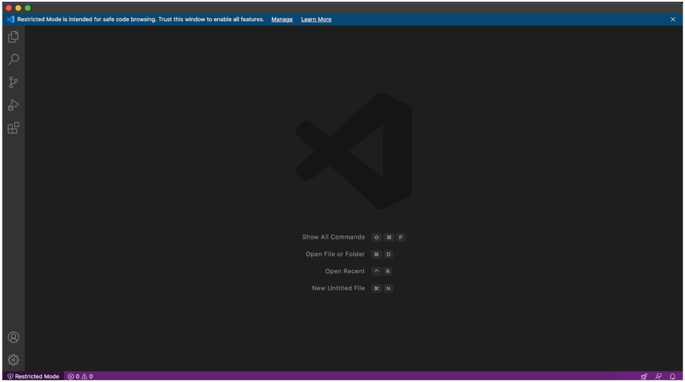
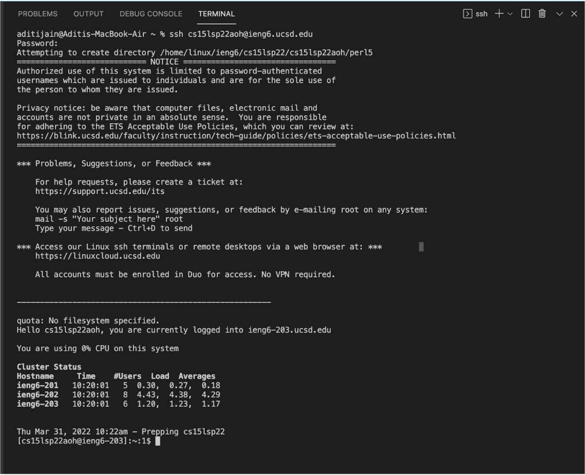
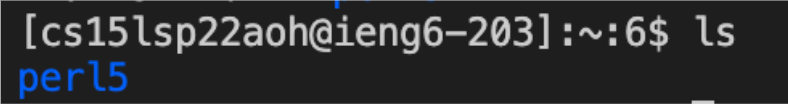
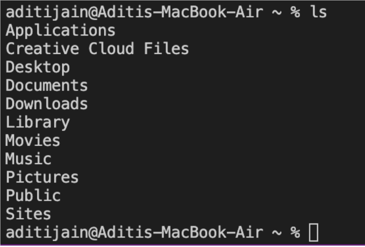
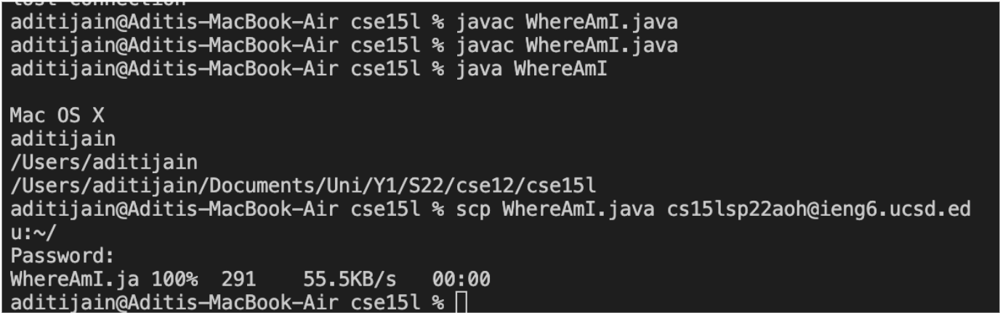
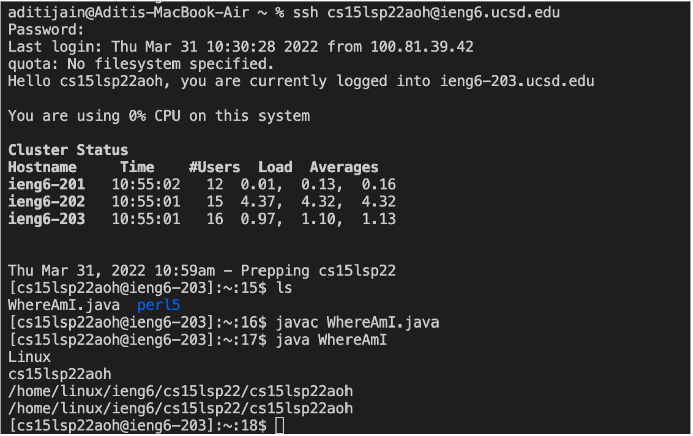
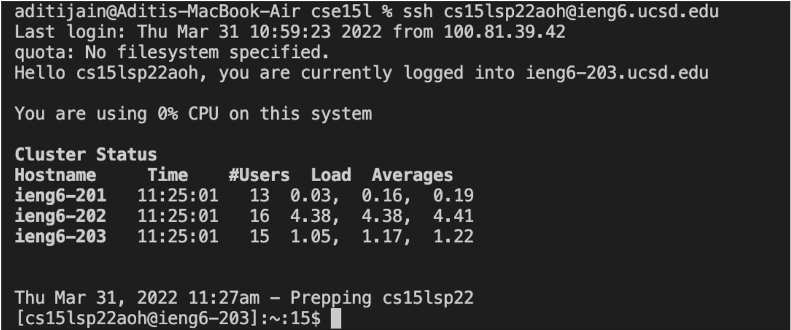
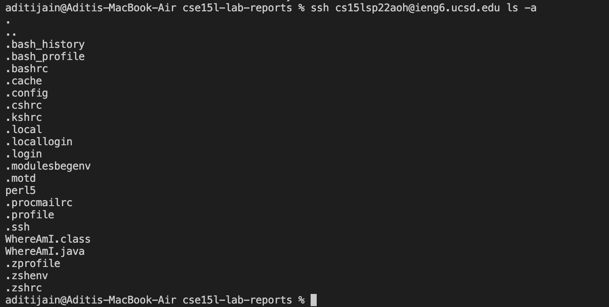

# **How To Log into a Course-Specific Account on ieng6**
## Installing VScode
1. Go to the Visual Studio Code website [(link)](https://code.visualstudio.com/), and follow the instructions to download it on your computer. Visual Studio Code should open on your computer like below.

## Remotely Connecting
2. To remotely connect, open terminal in VS Code by clicking View then Terminal along the top of your screen in the menu bar.   Enter the command `$ ssh cs15lsp22zz@ieng6.ucsd.edu` and replace the "zz" with the letters in your course-specific account.     If you are connecting to the server for the first time, say yes to messages allowing you to continue connecting. Then type your password and your output should look something like this.    Now your terminal is connected to a computer in the CSE basement as a client, and any commands you run will run on that computer which acts as a server.

## Trying Some Commands
3. Now you can try running some commands `cd`, `ls`, `pwd`, `mkdir`, and `cp`. We can see the files that exist on the computer when inputting the commands. Specific added letters with hyphens specify or reveal more files. Below is an example of running the `ls` command on the server vs. my local computer.  

## Moving Files with scp
4. You can move files from your local computer to the remote one using `scp` command. On your local terminal, run `scp File.java cs15lsp22zz@ieng6.ucsd.edu:~/` where File.java is replaced with the file you would like to copy over to the remote computer and the "zz" in the username is replaced with your username's letter. You should be asked to enter your password.       After you put in your password, log into ieng6 with `ssh` again and use the `ls` command to see your file in the directory. Now you can run it on the ieng6 computer using `javac` and `java`.  

## Setting an SSH Key
5. Use the `ssh-keygen` on your local computer to allow you to skip inputting your password everytime you connect to the remote computer. This should prompt you to enter a passphrase for which you should enter nothing. After confirming it, copy the public key to the .ssh directory of your user account on the server.       Enter `$ ssh cs15lsp22zz@ieng6.ucsd.edu` on local computer and now you should be on the server without a password. Use the command `$ mkdir .ssh` to make a directory then logout. Back on the client computer, use the command `scp /Users/*user-name*/.ssh/id_rsa.pub cs15lsp22zz@ieng6.ucsd.edu:~/.ssh/authorized_keys`. Remember to replace the username and "zz" with your personal ones. Below is an image of what it should look like when you log in without a password. 

## Optimizing Remote Running
6. To optimize remote running, using the one line to login and type multiple commands. As seen below.

