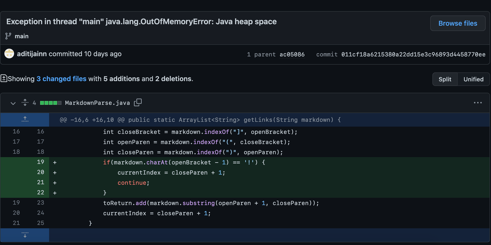
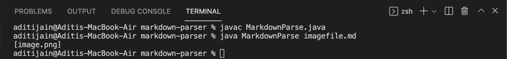
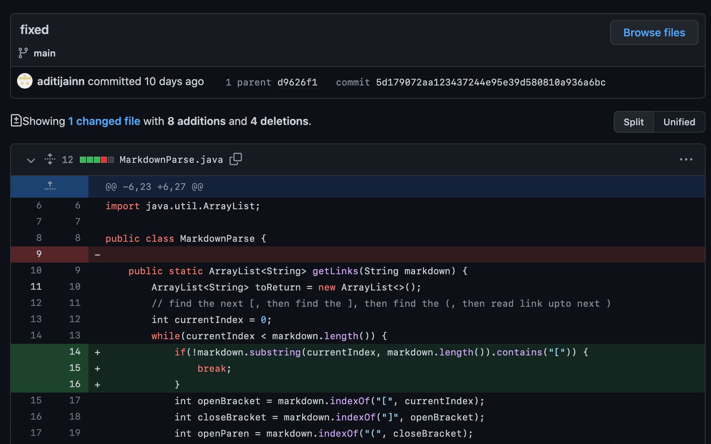
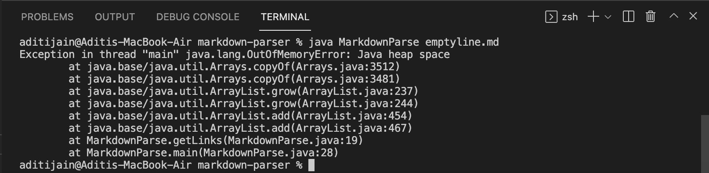
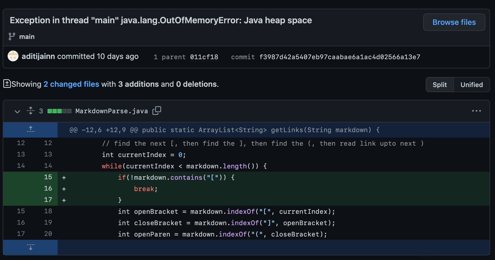
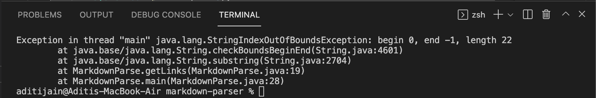

# **Bugs & Symptoms**
## Bug Fix #1
The code change made to fix the first bug is shown below. The link test file for a failure-inducing input that prompted me to make this change is [here](https://github.com/aditijainn/markdown-parser/blob/main/imagefile.md).

The first test that was failing was an image. The bug was that it displays the image name even though we are looking specifically for links, therefore though the code runs it doesn’t succeed as it doesn’t give us what we want. The resulting symptom was that image links would be printed as output too.To fix this we checked for the `!` before the `[` printing to make sure the link isn’t for an image. If it was, we forced the while loop to break, otherwise it could continue. The symptom that the failure-inducing input of an image link caused to be printed is shown below.

---
## Bug Fix #2
The code change made to fix the second bug is shown below. The link test file for a failure-inducing input that prompted me to make this change is [here](https://github.com/aditijainn/markdown-parser/blob/main/emptyline.md).

For the second test, I added a new line after the first link which makes the code fail by causing an infinite loop. The bug was that the `getLinks` method would continue to index the next line as if it were a link without checkiig if it contains `[` before continuing the while loop. The resulting symptom was that it would cause an infinite loop. To fix this, I created a `substring` for `currentIndex` and `markdown.length()` and checked if it contains `[` before continuing the while loop. 

The symptom that the failure-inducing input caused to be printed is the `java.lang.OutOfMemoryError: Java heap space` shown below.

---
## Bug Fix #3
The code change made to fix the third bug is shown below. The link test file for a failure-inducing input that prompted me to make this change is [here](https://github.com/aditijainn/markdown-parser/blob/main/nolinks.md).

For the third test, if we put a file with no links, it gives us an `IndexOutOfBoundsException`. The bug was that the `getLinks` method indexed the `[` character. The resulting symptom was that if the file didn't have the `[` character, it would try to index a character that wasn't there. We thought this would also be fixed using the solution above but it was still giving us an `IndexOutOfBoundsException`. I figured out that it was on line 22 where the code checks for the `!` before the `[` as the index subtracts 1, resulting in a negative index. To fix this, I suggested adding `markdown.contains("!")` to the if statement condition, so it would only run if `!` was in the line. This resulted in the index not being out of bounds anymore, fixing the problem.

The symptom that the failure-inducing input caused to be printed is the `IndexOutOfBoundsException` shown below.

