# **Improving Remote Operations**
## Streamlining ssh Configuration
1. The images below show my `.ssh/config` file. I edited using VScode as seen below.
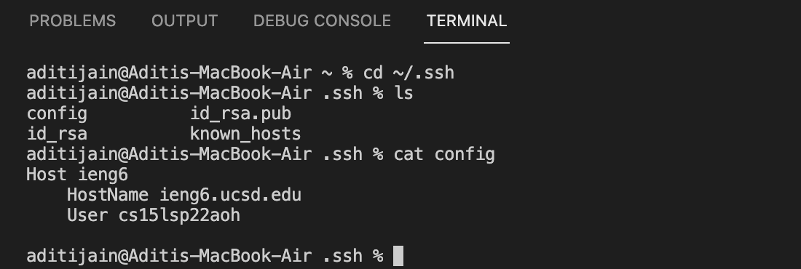
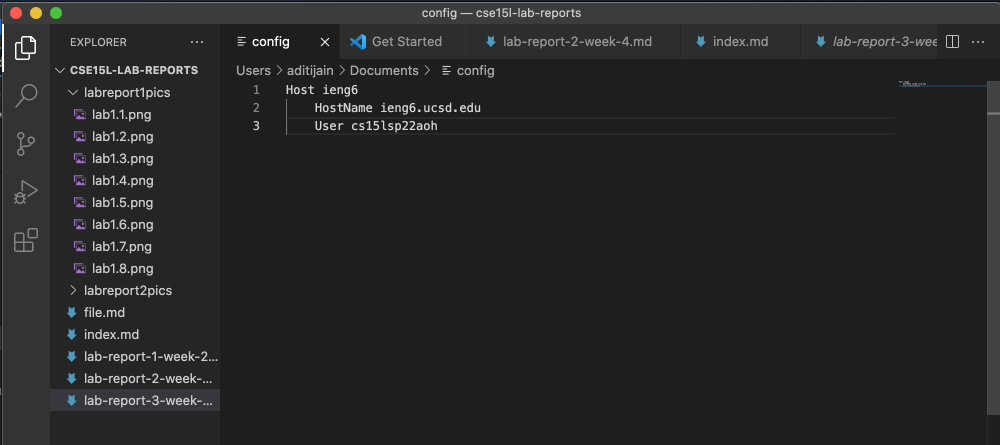
2. The next image is me logging in to my account using the `ssh` command using just the alias I chose.
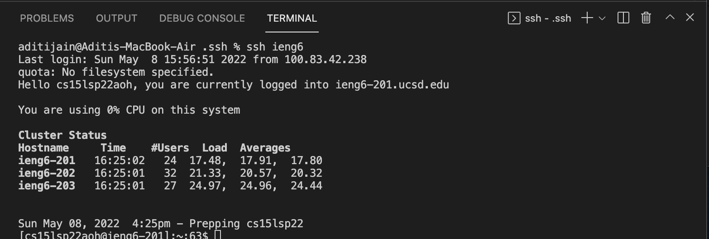
3. The next image shows an `scp` command copying the `test.txt` file to my account using just the alias I chose.
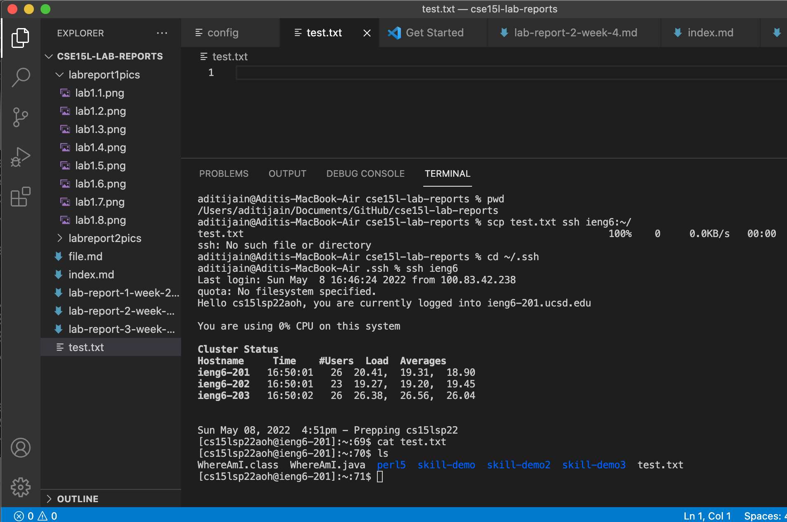
## Setup Github Access from ieng6
1. Below is where the public key I made is stored on Github and in my user account. My privatee key is stored in the directory as seen in the second picture.
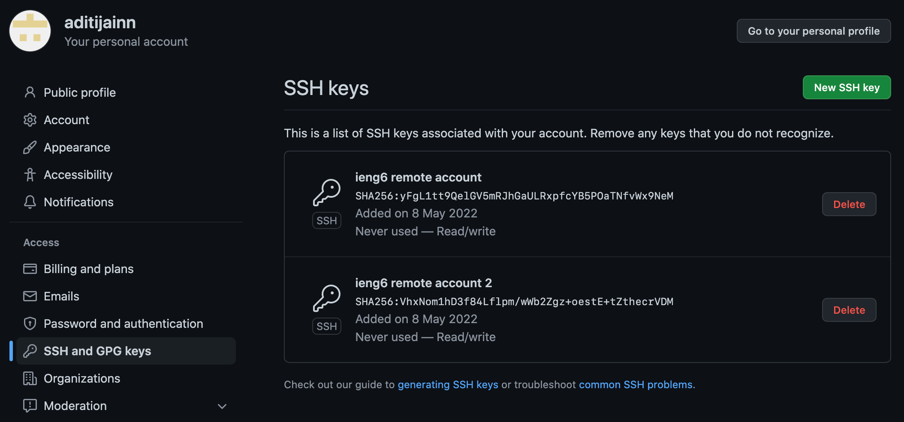
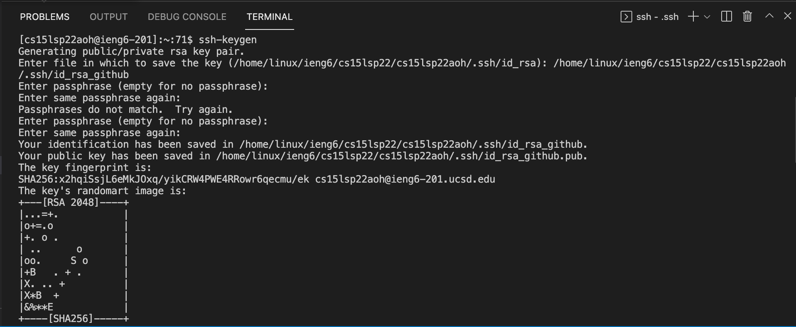
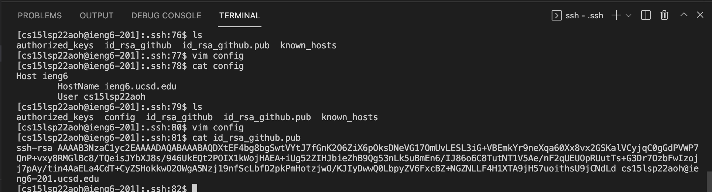
2. Below is me committing a change I made to my `SkillDemo.java` file.
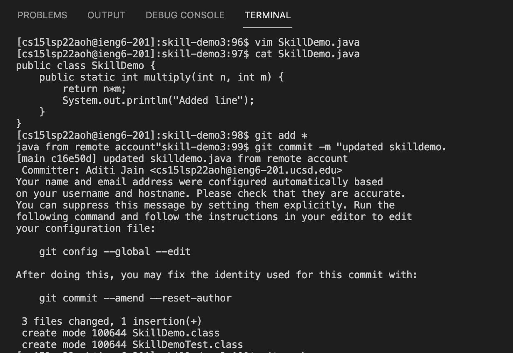
## Copy whole directories with scp -r
1. Below I copy my whole markdown-parse directory to my ieng6 account
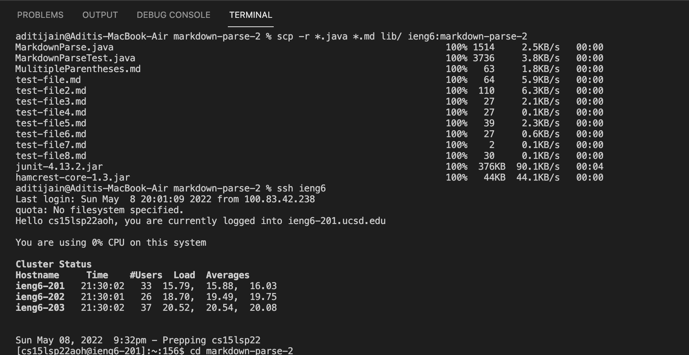
2. I log into my ieng6 account after doing this and compile and run the tests for your repository below.
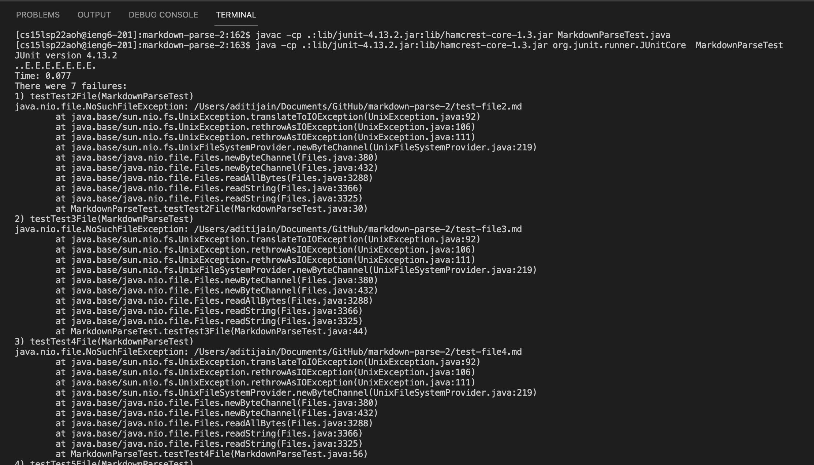
3. Here is me combining `scp`, `;`, and `ssh` to copy the whole directory and run the tests in one line.
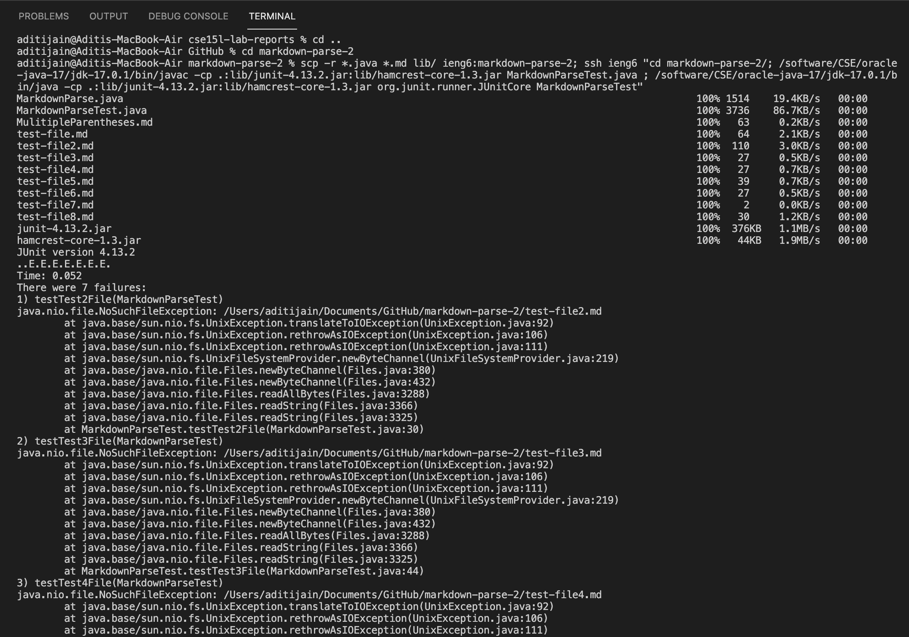
