# **Writing Clean Code**

## Links
1. [My markdown-parse repository](https://github.com/aditijainn/markdown-parser.git)
2. [The repository we reviewed](https://github.com/aejiang/markdown-parser)

## Test 1
1. Expected output using VScode preview:
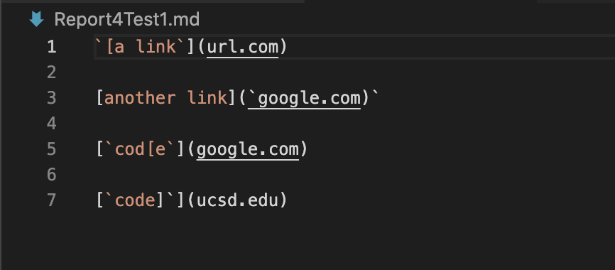
2. Junit test I created for it:
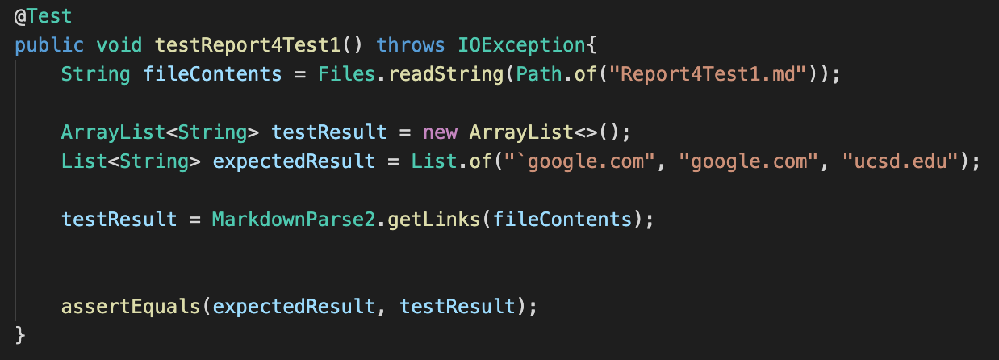
3. Corresponding output when running the test:
    - My implementation: test failure
    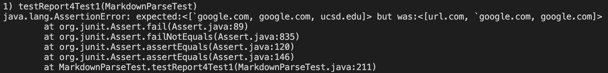
    - The implementation I reviewed in Week 7:
    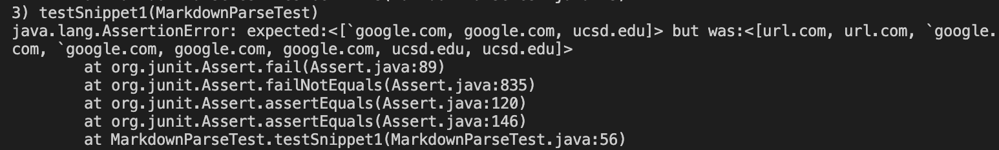
4. Small code change: 

## Test 2
1. Expected output using VScode preview:
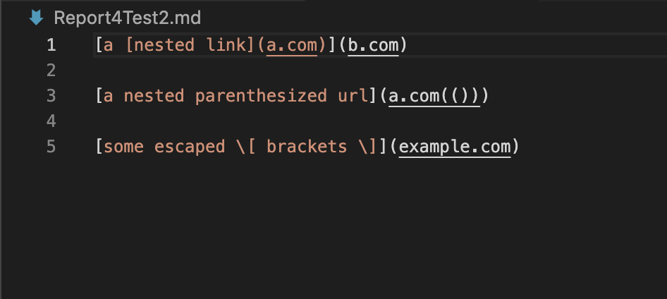
2. Junit test I created for it:
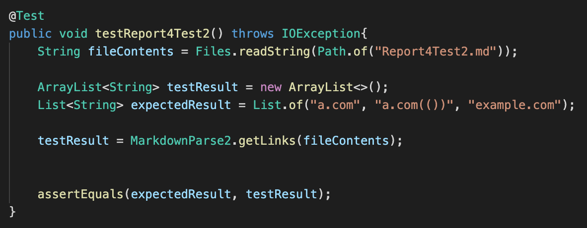
3. Corresponding output when running the test:
    - My implementation: test failure
    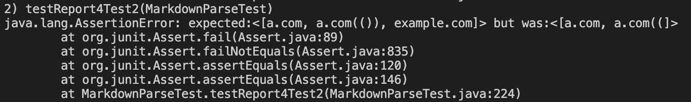
    - The implementation I reviewed in Week 7:
    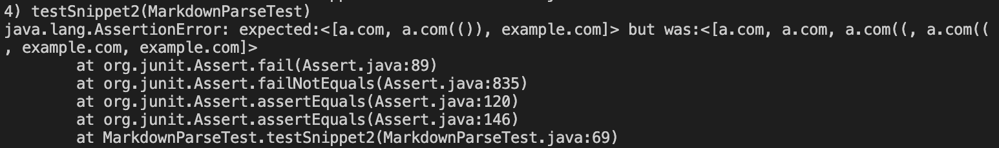
4. Small code change: 

## Test 3
1. Expected output using VScode preview:
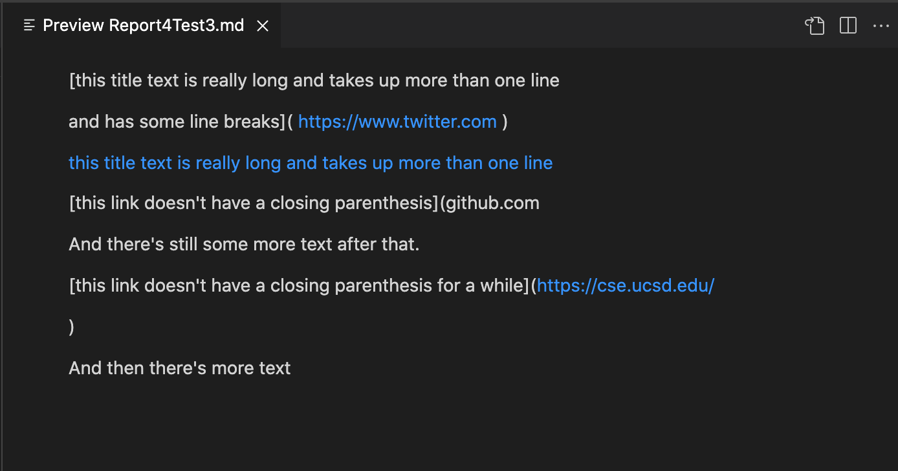
2. Junit test I created for it:
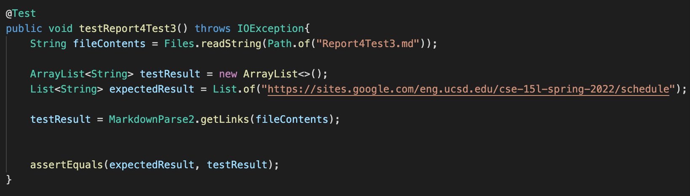
3. Corresponding output when running the test:
    - My implementation: test failure
    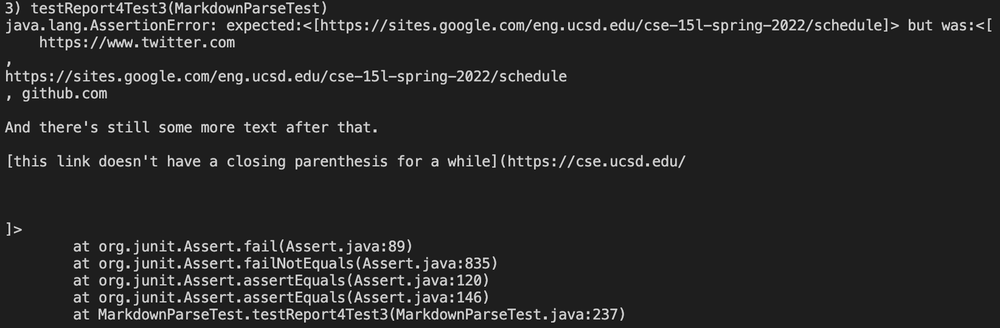
    - The implementation I reviewed in Week 7:
    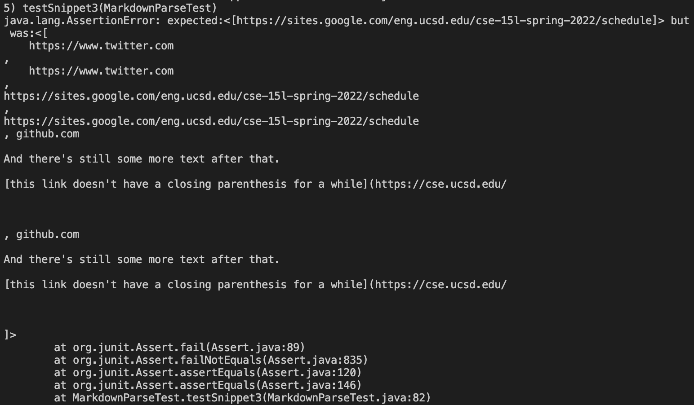
4. Small code change: 
