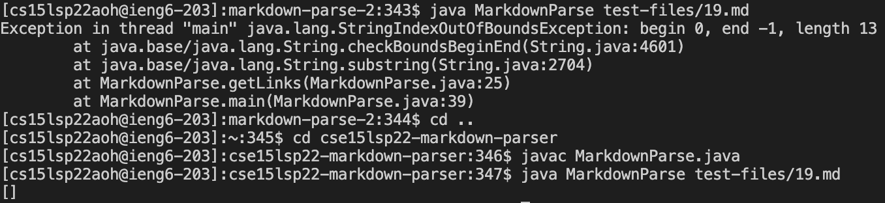
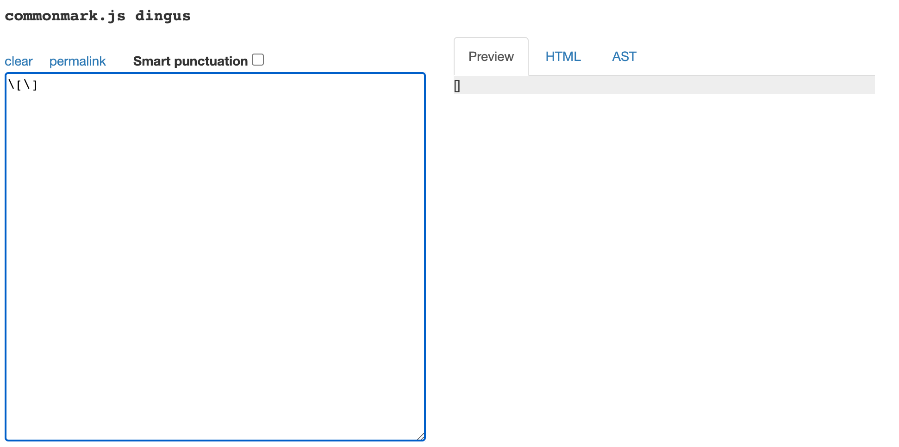
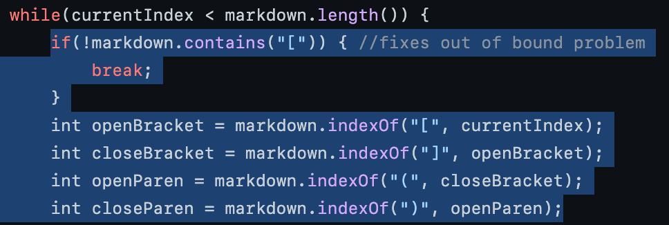
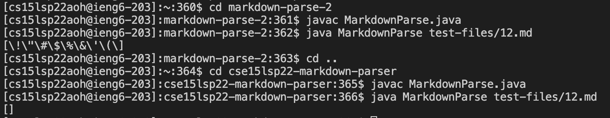
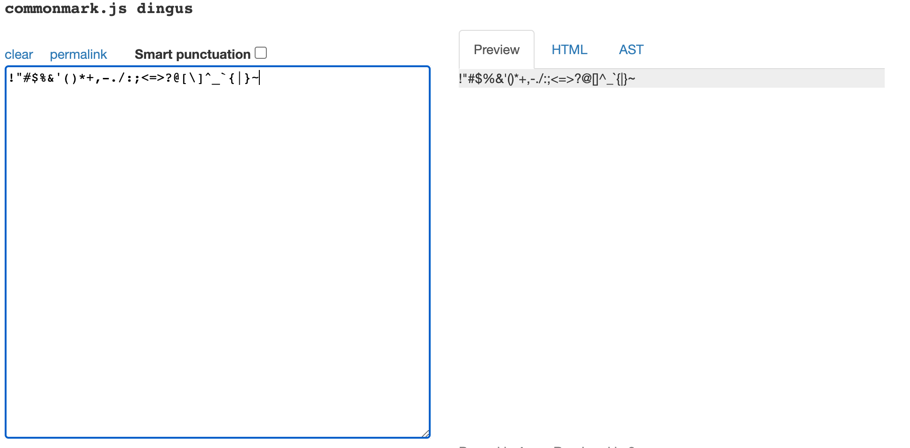
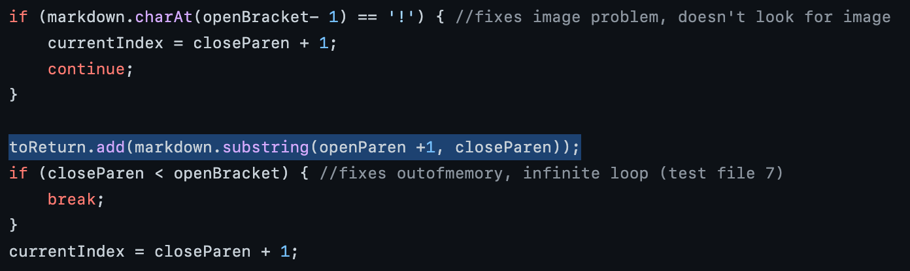

# **Markdown Parse Different Tests**

## Different Results
1. To find tests with different results, I added some code to `script.sh` print out the name of each test file before its output. Then I ran `vimdiff` on the resulsts of a running a bash for loop to show me the differences between the files. However, this print out weird results that didn't match the output so I just manually ran random test files in each directory to find the difference.

## Test File #1
1. [Link](https://github.com/nidhidhamnani/markdown-parser/blob/main/test-files/19.md) to test-file with different results
2. The `cse15lsp22-markdown-parser` implementation is correct. Below shows that my implementation gives an `StringIndexOutOfBoundsException` while `cse15lsp22-markdown-parser`'s implementation gives an empty `[]`.

3. Below is the expected output which is an empty `[]`:

4. The problem in the code for my implementation is that I assume the `()` as part of the link format exists and assign it an index. Since `(` is not present in the file, it gets -1 index and thus the exception as said ends at -1. To fix this, I would have to check if each character `[`,`]`,`(`, and`)` are contained in markdown before assigning it an index. This would not force it to throw an exception as index would not be -1. The part of the code I would have to fix is highlighted below. 

## Test File #2
1. [Link](https://github.com/nidhidhamnani/markdown-parser/blob/main/test-files/12.md) to test-file with different results
2. The `cse15lsp22-markdown-parser` implementation is correct. Below shows that my implementation gives different results than expected.

3. Below is the what commonmark.js shows with preview. The expected output is an empty `[]` as there is no link.

4. The problem in the code for my implementation is that it printed all the symbols before the `(` with `\` seperating each of them. The bug that caused this to happen is that my returning statement creates a substrict using the open parentheses + 1 and the closed parentheses index. Since this would be these indexes are equal as the closed parentheses is right after the open parentheses, it just loops from the beginning putting `\` between each symbol as this is the character in between `[]`. The part of the code that would have to be fixed is shown below.

